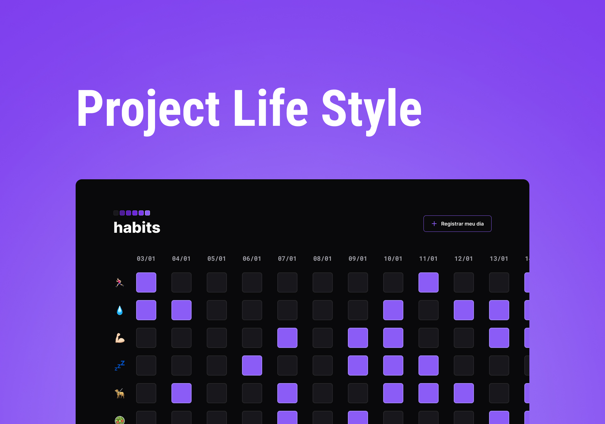

<h1 align="center"> Project Life Style </h1>

 This is a project created together with a RocketSeat event.

  

  <a href="#-tecnologias">Tecnologias</a>&nbsp;&nbsp;&nbsp;|&nbsp;&nbsp;&nbsp;
  <a href="#-projeto">Projeto</a>&nbsp;&nbsp;&nbsp;|&nbsp;&nbsp;&nbsp;
  <a href="#-layout">Layout</a>&nbsp;&nbsp;&nbsp;|&nbsp;&nbsp;&nbsp;
  <a href="#memo-licença">Licença</a>

  

 

## 🚀 Technologies

This project was developed with the following technologies:

- HTML
- SASS
- JavaScript - DOM, JSON

## 💻 Project

The "Life Style", it is a simple habit tracking project with a straightforward layout, the goal of the project is to help users easily monitor and control their habits.

## 🔖 Deploy

EM BREVE
